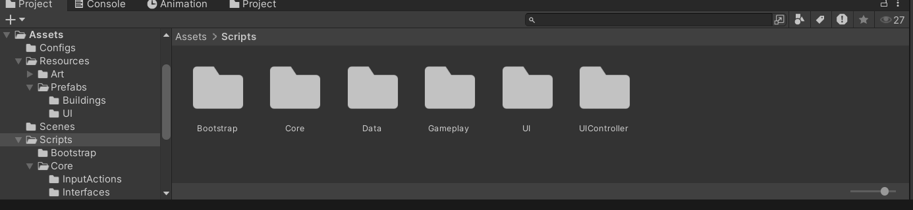
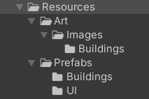
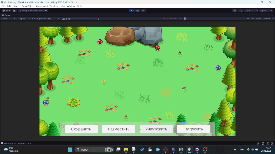
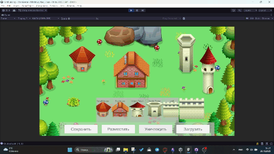
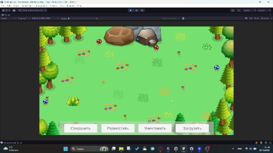

# GridBuilding
Демо 2д игры демонстрирующее создание зданий и размещение их по сетке. Предстовляет собой сцену на которой можно размещать и удалять задания размещаемые по сетке. Сохранять и загружать прогресс по нажатию по кнопке.

# Структура
- Скрипты в проекте разделены в отдельные модули с помощью использования Assembly Definition. Существуют следующие модули: Core, Gameplay, UI, UIController, Data, Bootstrap.
- Точка входа в проект на сцене Bootstrap. Данная сцена использует для того, чтобы быть уверенным, что все данные и связи подгружены и готовы к испльзованию перед запуском основной сцены. 
- Для отслеживания ввода используется New Input System.
- Данные о размещенных зданиях хранятся между сессиями в json формате. При нажатии на кнопки сохранить и загрузить они сохраняются или извлекаются из файла.
- Конфигурационный файл содержащий информацию о каждом здании хранится в формате json. В нем расписано то, какие клетки занимает здание, его название, путь к префабу, путь к изображению. Предназначен для изменения данных не делая новый билд каждый раз, чтобы сделать минорные изменения.
- Пользовательский интерфейс реализован по принципцу MVC с разделением на модель представляющей данные, UI и контролер.
- Заранее не создается сетка в определенном размере. При расмещении зданий берутся координаты координаты из мирового пространства и преобразоваваются в сетку через мат формулу. Таким образом записывается только та информация которая хранится в мире игры.

# Gameplay 
- При нажатии на кнопку Разместить появляется панель хранящая в себе все возможные здания для размещения. При нажатии на здание, оно появляется под курсором и его можно разместить по сетке на локации нажатием на левую кнопку мыши. Если попытатся разместить здание по верх другого здания, то не получится, так как есть проверка на занятость ячеек.
- Размещеное здание можно удалить. Для этого нужно нажать на кнопку уничтожить, после этого игра переключается в режим удаления и при нажатии на левую кнопку мыши по зданию оно уничтожется, а клетки, что оно занимет будут овобождены.
- При нажатии на кнопку сохранить происходит сохранение игры и информация о том какие клетки заняты записываются в json файл.
- При нажатии загрузить из json выгружается информация о занятых клетках из файла и реальные клетки помечаются как занятые.

# Скрины
Папки со скриптами разбитые в отдельные модули с помощью использования Assembly Definition

 

Так устроены папки к месту где хранятся префабы и картинки для конфигурационных файлов

 

# Гиф, могут загрузится не сразу, нужно подождать
Размещение зданий по сетке

 

Удаление зданий

 

Загрузка зданий после сохранения по нажатию кнопки

 

Удаление после загрузки демонстрация того, что загружать можно не только при включении

 
